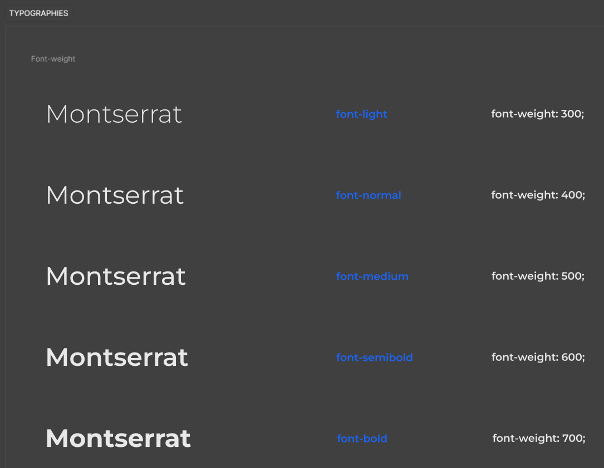
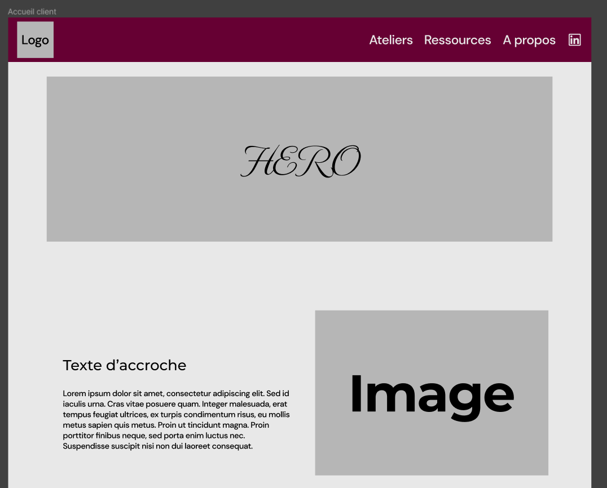

# Boennologie

Boennologie est une application web permettant aux visiteurs de participation à des ateliers de dégustation de vins.

## Table de contenus 
- [Boennologie](#boennologie)
  - [Table de contenus](#table-de-contenus)
  - [Initialiser le projet](#initialiser-le-projet)
  - [L'équipe](#léquipe)
  - [Technologies](#technologies)
  - [Fonctionnalités](#fonctionnalités)
    - [Public](#public)
    - [Participant](#participant)
    - [Administrateur](#administrateur)
  - [Schéma de la base de données](#schéma-de-la-base-de-données)
  - [Documentation de l'API](#documentation-de-lapi)
  - [Maquettage](#maquettage)

## Initialiser le projet

Cloner le projet

```bash
git clone git@github.com:ESGI-IW-M1-2023-2024/hackathon.git
```

Se placer dans le dossier du projet:
```bash
cd hackathon
```

Exécuter l'utilitaire [Make](https://ioflood.com/blog/install-make-command-linux/#:~:text=In%20most%20Linux%20distributions%2C%20the,command%20sudo%20yum%20install%20make%20.):

```bash
make build
```

Se rendre sur le site [Boennologie](localhost:5173)

## L'équipe

|           Chef de projet            |         Lead Tech Symfony         |          DB Administrator           |
| :---------------------------------: | :-------------------------------: | :---------------------------------: |
|               Quentin               |              Mathis               |               Olivier               |
|  |  |  |

|         UX/UI Designer          |        Lead Tech React        |       FullStack Developper        |
| :-----------------------------: | :---------------------------: | :-------------------------------: |
|              Kenza              |             Loan              |              Arnaud               |
|  |  |  |

## Technologies
- Environnement: [Docker](https://www.docker.com)
- Versionnement: [Git](https://git-scm.com) sur la plateforme [GitHub](https://github.com)
- Serveur Web: [NGINX](https://www.nginx.com)
- Serveur de base de données: [MariaDB](https://mariadb.org)
- BackEnd: [PHP](https://www.php.net) avec le framework [Symfony](https://symfony.com)
- FrontEnd: [TypeScript](https://www.typescriptlang.org) avec le framework [React](https://fr.react.dev)
- API Client: [Bruno](https://www.usebruno.com)
- Maquettage UX/UI: [Figma](https://www.figma.com/fr/design/)
- Création de graphique: [Lucid](https://lucid.co/fr)
- Analyse de code: [SonarCloud](https://sonarcloud.io)

## Fonctionnalités

### Public
- [ ] Consultation des pages vitrines: accueil, ateliers, présentations d'Olvier, cgu
- [ ] Consultation des ateliers à venir
- [ ] Consultation des détails d'un atelier
- [ ] Inscription à un atelier

### Participant
- [ ] Réception d'un mail après inscription (envoie automatique)
- [ ] Réception d'un rappel pour l'atelier à venir (envoie automatique)
- [ ] Réception d'un mail récapitulatif après l'atelier (envoie automatique possible)
- [ ] Consultation des détails avancés d'un atelier avec saisi d'un code

### Administrateur
- [ ] Gestion des Régions
- [ ] Gestion des Thématique
- [ ] Gestion des Organisation
- [ ] Gestion des Ateliers
- [ ] Gestion des Réservations
- [ ] Envoie d'un mail pour à la fin d'un atelier
- [ ] Consultation des détails avancés d'un atelier

## Schéma de la base de données

Schéma de la base de données avec l'outils [DBDiagram](https://dbdiagram.io/d/Boenologie-6626395203593b6b619e916d).
<details>

<summary>
Voir l'apperçu
</summary>


</details>

## Documentation de l'API

La documentation de l'API est automatiquement générée avec le bundle [Nelmio/ApiDocBundle](https://symfony.com/bundles/NelmioApiDocBundle/current/index.html). \
Elle est consultable depuis deux urls différentes:
- Format [Swagger](localhost/api/doc)
- Format [JSON](localhost/api/doc.json)
- 
## Maquettage

Le maquettage du site est réalisé avec l'outils collaboratif [Figma](https://www.figma.com/fr/design/).

<details>
<summary>Apperçu d'un extrait du Design Sytem</summary>


</details>

<details>
<summary>Apperçu d'une Wireframe</summary>


</details>