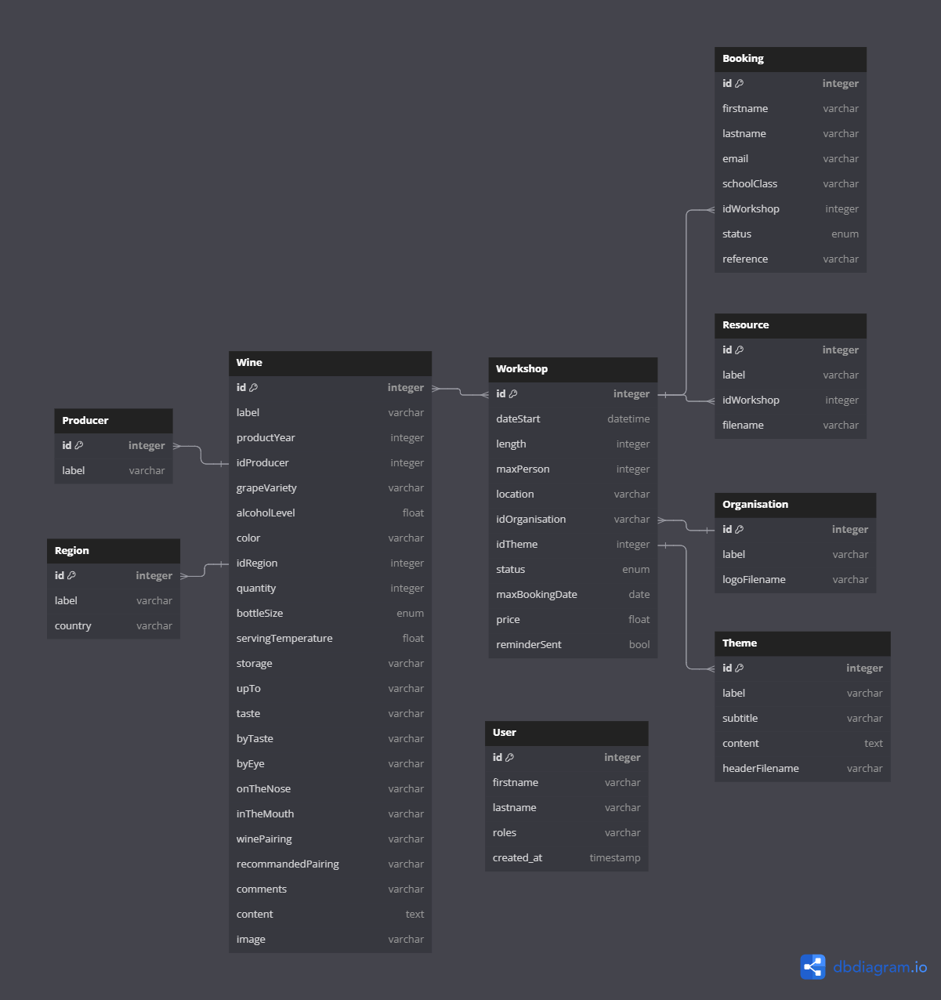

# Boennologie

Boennologie est une application web permettant aux visiteurs de participation à des ateliers de dégustation de vins.

## Fonctionnalités

### Public
- [ ] Consultation des pages vitrines: accueil, ateliers, présentations d'Olvier, cgu
- [ ] Consultation des ateliers à venir
- [ ] Consultation des détails d'un atelier
- [ ] Inscription à un atelier

### Participant
- [ ] Réception d'un mail après inscription
- [ ] Réception d'un rappel pour l'atelier à venir
- [ ] Réception d'un mail récapitulatif après l'atelier
- [ ] Consultation des détails avancés d'un atelier avec saisi d'un code

### Administrateur
- [ ] Gestion des Régions
- [ ] Gestion des Thématique
- [ ] Gestion des Organisation
- [ ] Gestion des Ateliers
- [ ] Gestion des Réservations
- [ ] Envoie d'un mail pour à la fin d'un atelier
- [ ] Consultation des détails avancés d'un atelier

## Ressources

Schéma de la base de données avec l'outils [DBDiagram](https://dbdiagram.io/d/Boenologie-6626395203593b6b619e916d):



## Initialiser le projet

Cloner le projet

```bash
git clone git@github.com:ESGI-IW-M1-2023-2024/hackathon.git
```

Se placer dans le dossier du projet:
```bash
cd hackathon
```

Exécuter l'utilitaire [Make](https://ioflood.com/blog/install-make-command-linux/#:~:text=In%20most%20Linux%20distributions%2C%20the,command%20sudo%20yum%20install%20make%20.):

```bash
make build
```

Se rendre sur le site [Boennologie](localhost:5173)